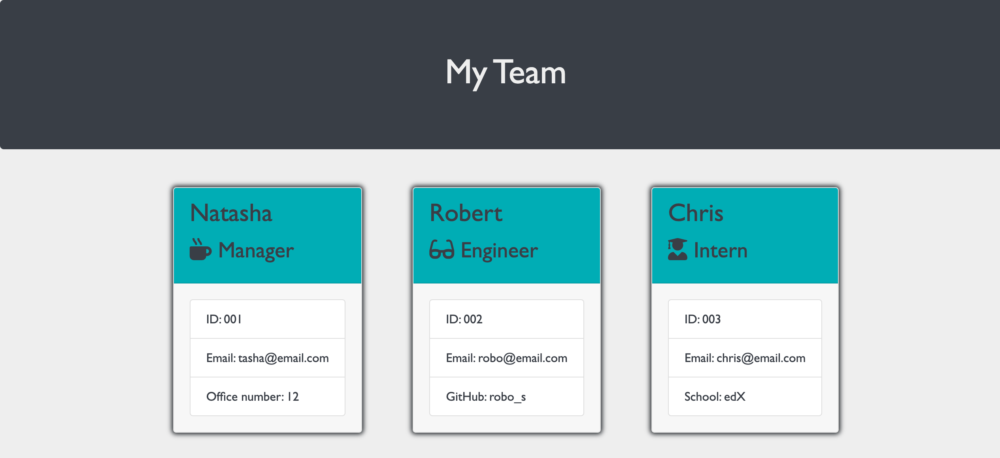

# Team Profile Generator

## Description

A simple command-line application that generates profiles for your work team. It allows you to input information about each team member, such as their name, role, email, and specific details based on their role. It will then generate an organised HTML page displaying the profiles of all team members for easy reference.

## Table of Contents

- [Technologies Used](#technologies-used)
- [Screenshot](#screenshots)
- [Installation](#installation)
- [Usage](#usage)
- [License](#license)
- [Contributing](#contributing)
- [Tests](#tests)
- [Questions](#questions)

## Technologies Used

- Javascript
- Node.js
- NPM
- Inquirer.js
- Jest (for testing)

## Screenshots

## Installation

To install the Team-Profile-Generator, you will first need to have Node.JS installed on your machine.

- Step 1
  - Clone the repo onto your local machine.

* Step 2
  - Run `npm i` from the root of the Team-Profile-Generator to install any dependencies.

## Usage

- Step 1
  - Open the terminal from the root of the Team-Profile-Generator.

* Step 2

  - Run the command `node index.js`.
  - Enter the information when prompted.

* Step 3
  - A new folder **generated** will be created containing the **team.html** file

## License

This project is covered under the MIT license.

## Questions

You can check out my Github [HERE](https://github.com/chrisS-88).

If you have any questions, feel free to reach out to me [HERE](mailto:chrissmart920@gmail.com).
